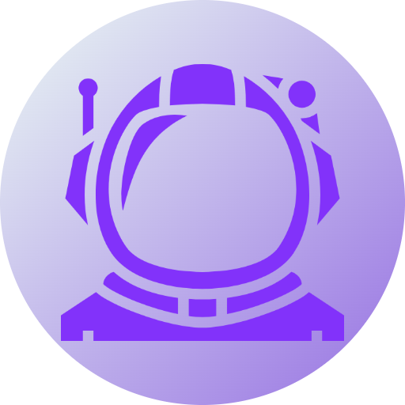

# Subspace


<p>Subspace is a social media community-based/forum website.Registered users are able to create communities and post related to any community. This project was created as my deliverables for CADV (Cloud Application Development) and DevOps (Development Operations) modules.</p>
<p>Subspace is build using microservices architecture which is part of the module requirement.The backend (Laravel) has been tested with PHPunit and the frontend (React Typescript) has been tested with Cypress.The test portion has been integrated into my Github Actions Pipeline and it will automatically test the application and ensure that it passed before deploying them to the servers.You can find them in the <a href="https://github.com/shantatei/web-subspace/actions">Actions</a> Tab.</p>


## Features

- `Authentication`
    - Register
    - Login
    - Logout
    - Change Password
    - Edit Account
    - Delete Account
    - View Profile
        - Posts
        - Joined Communities
        - Owned Communities
    - View Other User's Profile
        - Posts
        - Joined Communities
        - Owned Communities
- `Community`
    - Create Community
    - Edit Community
    - Delete Community
    - Join Community
    - Leave Community
    - View Communities
    - Owner/Member Role

- `Post`
    - Users can Post in the community
    - Add Tags to Post 
    - Edit their Post
    - Delete their Post
    - Search Post

- `Comment`
    - View Comments
    - Post Comment
    - Edit their Comment
    - Delete their Comment

## Usage

### Locally

Ensure you have PHP,Composer,Node.js and Docker Installed in your local machine

#### Laravel-Backend

Configure the following in the .env file 
```
DB_CONNECTION=
DB_HOST=
DB_PORT=
DB_DATABASE=
DB_USERNAME=
DB_PASSWORD=

AWS_ACCESS_KEY_ID=
AWS_SECRET_ACCESS_KEY=
AWS_DEFAULT_REGION=
AWS_BUCKET=
AWS_USE_PATH_STYLE_ENDPOINT=

JWT_SECRET=
```

Set up microservice configuration
```
$ cd 'Microservice Folder Here'
$ cp .env.example .env
$ php artisan migrate --seed
```
Running Docker Containers 
```
$ docker compose up --build
```

Running React
#### React-Frontend
```
$ cd react-subspace
$ npm i
$ npm run dev
```

### Deployment

Deployment is a bit different , but basically how I did was to have 2 servers , one for my backend and the other for my frontend.

#### Laravel Deployment Server
- Ensure you have `docker` and `docker-compose` installed on the server
- SSH into the server and install it manually (How I did it) 
```
$ cd ~
$ git clone this repo
$ cd web-subspace
$ docker-compose up -- build
```

#### React Deployment Server
- Configure Nginx in the server
- Drop the dist folder in /var/www/html according to your nginx config (Using STFP to drop folders in the server) after building the react project
<br>
```
$ cd react-subspace
$ npm i
$ npm run build
```

## Credits

- Much inspiration taken from Reddit 
- Used Linode to deploy my servers
- Used Digital Ocean for MySQL Database

## Tests

### Laravel

```
$ php artisan test ||  vendor/bin/phpunit
```

### React

```
$ npm run cypress:open
```

## Built using

- React Typescript
    - Vite
    - Chakra UI
    - Redux Toolkit
    - Redux Persist
    - Axios
    - React-Hook-Form
    - React-Select
    - React-Router-Dom
    - React-Icons
    - Javascript-Time-Ago
- Laravel
    - Tymon/Jwt-Auth
    - Docker
    - Docker-Compose
- Aws Services
    - S3 Bucket (Store Images)


